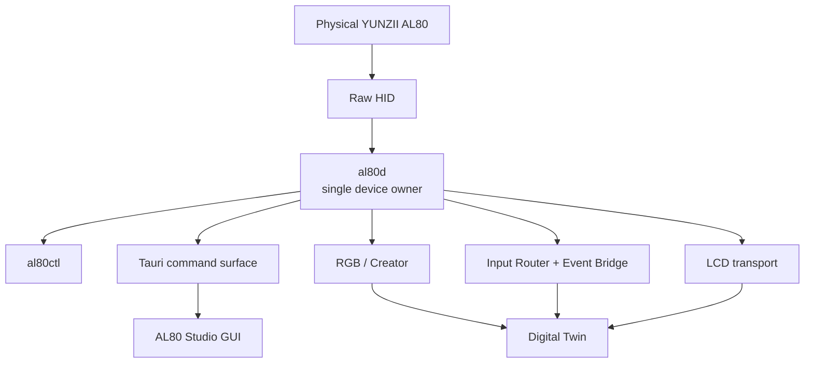

# AL80 Studio

**Open-source Linux-first control software, device broker, Creator environment, and reverse-engineering platform for the YUNZII AL80 keyboard.**

> **Project status:** Alpha. Core RGB, LCD, input, Creator, Event Bridge, and host-library foundations have physical validation history. The current **Live Digital Twin V1** source is **build-validated** and its final physical validation is pending.

AL80 Studio is an unofficial community project. It is not affiliated with, sponsored by, or endorsed by YUNZII.

---

## Why this project is different

AL80 Studio is not intended to be a thin clone of a vendor configurator.

The project is building a reusable and documented platform around the AL80 with a few strict principles:

1. **One Raw HID owner.** `al80d` owns the device transport; GUI and CLI communicate through daemon IPC.
2. **No fake capabilities.** If hardware state cannot be read, Studio says so instead of inventing a value.
3. **Volatile first.** Runtime configuration is preferred over EEPROM or persistent device writes.
4. **Fail closed.** Unknown protocol state or malformed responses stop the workflow.
5. **Physical evidence matters.** Compiling is not the same as physical validation.
6. **Firmware work is explicit.** Flashing is treated as an advanced hardware operation, not a normal preference change.

---

## Current capabilities

| Area | Capability | Status |
|---|---|---|
| Device broker | Single-owner `al80d` Raw HID transport | Physically validated |
| RGB | Runtime RGB ON/OFF | Physically validated |
| RGB | Snake / custom overlay | Physically validated |
| Creator | 82-LED Creator Scene transport | Physically validated |
| Creator | 79 key LEDs + 3 accent LEDs | Physically validated |
| Creator | Host effect engine foundation | Build validated |
| Inputs | 12 binding slots / 24 allowlisted actions | Physically validated |
| Inputs | Raw HID Event Bridge | Physically validated |
| Inputs | Automatic typed LCD action feedback | Physically validated |
| LCD | HOME / Volume / Mute | Physically validated |
| LCD | Typed generic feedback | Physically validated |
| Host libraries | Creator scenes / input profiles / host profiles | Physically validated |
| GUI | Futuristic workstation UI | Active development |
| Digital Twin | Creator scroll preservation | Build validated |
| Digital Twin | Pointer-orbit 3D with editable keys | Build validated |
| Digital Twin | Firmware-backed 82-LED telemetry (`0x4D`) | **Physical validation pending** |
| Digital Twin | Dashboard Snake/Creator live mirror | **Physical validation pending** |
| LCD Twin | Host logical-state mirror | **Physical validation pending** |
| Windows | Native backend | Roadmap |

### Current Live Digital Twin truth boundary

The `0x4D` candidate mirrors frames authored by the AL80-specific firmware path:

- Snake / Heart overlay;
- Creator Scene;
- low-battery safety red.

When neither AL80 overlay nor Creator Scene owns the final frame, native QMK RGB continues normally but Studio reports the exact framebuffer as unavailable instead of simulating it.

The LCD Twin currently mirrors **host-driven logical state** (HOME / Volume / Mute / typed feedback). It does not claim arbitrary pixel framebuffer readback from the physical LCD.

---

## Architecture



### Device ownership invariant

```text
YUNZII AL80
    |
/dev/hidrawN
    |
al80d
    |
    +-- typed IPC --> al80ctl
    +-- typed IPC --> Tauri GUI
    +-- typed IPC --> future integrations
```

Two independent readers on the same Raw HID interface can consume each other's responses. AL80 Studio therefore keeps **exactly one persistent HID owner**.

---

## Repository layout

```text
al80-studio/
├── app/                     Tauri + TypeScript GUI
├── core/                    Rust transport, daemon and CLI
├── docs/                    Architecture, Creator and RE documentation
├── firmware/qmk/            Reproducible AL80 QMK source snapshot
├── packaging/               systemd + udev examples
└── tools/                   Project tooling
```

---

## Hardware and platform

Primary development target:

- **Keyboard:** YUNZII AL80
- **Host OS:** Linux
- **Primary development distribution:** Fedora
- **Normal USB VID:PID observed:** `28e9:30af`
- **LCD:** 96 × 160 RGB565
- **RGB:** 82 LEDs total
  - 79 key LEDs
  - 3 accent LEDs

---

## Quick start

### Clone

```bash
git clone https://github.com/Thearius123/al80-studio.git
cd al80-studio
```

### Build the Rust core

```bash
cargo build --release   --manifest-path core/Cargo.toml   --bin al80d   --bin al80ctl
```

Run tests:

```bash
cargo test --manifest-path core/Cargo.toml
```

Current baseline:

```text
20 core/library tests
4 al80d event-pump tests
```

### Build the frontend

```bash
cd app
npm ci
npm run build
cd ..
```

### Check / build Tauri

```bash
cargo check --manifest-path app/src-tauri/Cargo.toml

cargo build --release   --manifest-path app/src-tauri/Cargo.toml   --bin al80-studio-app
```

### Install the daemon locally

```bash
install -Dm755 core/target/release/al80d "$HOME/.local/bin/al80d"
install -Dm755 core/target/release/al80ctl "$HOME/.local/bin/al80ctl"

mkdir -p "$HOME/.config/systemd/user"

install -Dm644 packaging/systemd/al80d.service   "$HOME/.config/systemd/user/al80d.service"

systemctl --user daemon-reload
systemctl --user enable --now al80d.service
```

Then:

```bash
al80ctl status
al80ctl capabilities
```

---

## Linux HID permissions

An example udev rule is included at:

```text
packaging/udev/99-al80.rules
```

Review it before installation:

```bash
sudo install -Dm644 packaging/udev/99-al80.rules   /etc/udev/rules.d/99-al80.rules

sudo udevadm control --reload-rules
sudo udevadm trigger
```

Reconnect the keyboard afterward.

---

## Firmware

The repository includes the AL80-specific QMK source snapshot under:

```text
firmware/qmk/keyboards/yunzii/al80/
```

It is intentionally **not a complete QMK checkout**.

Create or use a QMK checkout:

```bash
qmk setup qmk/qmk_firmware
```

Copy the AL80 subtree:

```bash
rsync -a   firmware/qmk/keyboards/yunzii/al80/   "$HOME/qmk_firmware/keyboards/yunzii/al80/"
```

Compile:

```bash
cd "$HOME/qmk_firmware"
qmk compile -kb yunzii/al80 -km al80_rgb_probe
```

### Flashing warning

Do not treat flashing as an ordinary setup step.

Before flashing:

- compile successfully;
- record firmware SHA256 and size;
- keep a known-good rollback image;
- verify target and bootloader;
- understand the board recovery path;
- perform a controlled physical regression afterward.

AL80 Studio prefers volatile runtime changes wherever possible.

---

## CLI examples

```bash
al80ctl ping
al80ctl status
al80ctl capabilities

al80ctl rgb on
al80ctl rgb off

al80ctl overlay status
al80ctl overlay on
al80ctl overlay off

al80ctl scene status
al80ctl scene off
al80ctl scene solid 112233

al80ctl input status
al80ctl input dump

al80ctl lcd home
al80ctl lcd volume 42
al80ctl lcd mute 42
```

With Live Digital Twin V1 runtime/firmware support:

```bash
al80ctl telemetry rgb
al80ctl lcd status
```

---

## Raw HID protocol namespaces

| Command | Purpose |
|---|---|
| `0x47` | Matrix scan / runtime telemetry |
| `0x48` | RGB runtime |
| `0x49` | Overlay / Snake |
| `0x4A` | Creator Scene |
| `0x4B` | Input Router |
| `0x4C` | Input Event Bridge |
| `0x4D` | Live RGB telemetry candidate |

Protocol behavior should be documented in `docs/reverse-engineering/`, not hidden as unexplained magic constants in UI code.

---

## Creator Mode

Creator Mode is an editing environment, not just a preset picker.

Current concepts include:

- exact recovered AL80 key layout;
- per-key colors;
- accent LEDs;
- Creator scene library;
- typed host effects;
- explicit Save vs Apply;
- Top / 3D views;
- Fit / 100% / Re-center;
- pointer-orbit 3D candidate;
- exact LED addressing independent of camera pose.

The effect engine foundation currently includes:

- Solid;
- Pulse;
- Comet;
- Snake.

The long-term direction is a typed **Effect Graph**, not arbitrary shell execution.

---

## Inputs

Input Router uses a bounded model:

- 12 binding slots;
- 24 allowlisted actions;
- explicit event/trigger values;
- safe fallback when disabled.

The Input Event Bridge stays on the same single-reader Raw HID transport.

---

## LCD

Physically validated host-driven LCD operations include:

- HOME;
- Volume;
- Mute;
- typed generic feedback;
- automatic typed feedback from routed actions.

Current generic feedback uses the native 96 × 160 RGB565 transport.

### Not currently claimed

AL80 Studio does **not** currently claim:

- arbitrary physical LCD framebuffer readback;
- persistent custom GIF/image storage;
- arbitrary permanent LCD media writes.

Those need separate protocol and physical-validation milestones.

---

## Host libraries and profiles

Named Studio libraries are host-side persistence, not fake keyboard persistence.

Current host libraries include:

- Creator scenes;
- input profiles;
- host profiles.

They are intentionally separate from EEPROM and firmware persistence.

---

## Development safety rules

Hardware-facing contributions should preserve these boundaries:

- keep `al80d` as the only persistent Raw HID reader;
- do not silently add EEPROM writes;
- do not add arbitrary command execution to extensions;
- document new protocol bytes;
- include rollback/recovery notes for firmware work;
- do not describe build-only work as physically validated;
- fail closed when exact hardware truth is unavailable.

See [`CONTRIBUTING.md`](CONTRIBUTING.md).

---

## Validation philosophy

A normal hardware-facing feature lifecycle is:

```text
reverse engineer
    ↓
document protocol
    ↓
implement
    ↓
unit/regression tests
    ↓
build-only gate
    ↓
controlled hardware validation
    ↓
physical regression
    ↓
freeze / commit
```

The project intentionally distinguishes:

- implemented;
- build validated;
- physically validated;
- production-ready.

These are not synonyms.

---

## Current roadmap

### Near term

- physically validate Live Digital Twin V1;
- finish interactive 3D Device Twin behavior;
- live Dashboard keyboard mirror;
- LCD logical mirror polish;
- improve telemetry performance and observability.

### Next

- broader RGB observability where hardware truth allows it;
- richer LCD protocol research;
- Creator Effect Graph;
- command palette;
- extension SDK;
- better device discovery UX.

### Later

- Windows transport/backend;
- broader community AL80 testing;
- packaged installers;
- optional extension/plugin ecosystem.

---

## Documentation

Start with:

- [`docs/INDEX.md`](docs/INDEX.md)
- [`docs/project-status.md`](docs/project-status.md)
- [`docs/architecture/open-source-overview.md`](docs/architecture/open-source-overview.md)
- [`docs/reverse-engineering/README.md`](docs/reverse-engineering/README.md)
- [`firmware/qmk/README.md`](firmware/qmk/README.md)

---

## Contributing

Contributions are welcome, especially for:

- protocol documentation;
- Linux HID robustness;
- Creator tooling;
- typed effect primitives;
- UI/UX;
- AL80 hardware testing;
- Windows backend research.

Read [`CONTRIBUTING.md`](CONTRIBUTING.md) before submitting code.

---

## Security

Do not publish secrets, private filesystem contents, or unrelated personal device identifiers in issues.

See [`SECURITY.md`](SECURITY.md).

---

## Licensing

The repository uses split licensing:

- host app, Rust core and original project documentation: **MIT OR Apache-2.0**;
- QMK-derived firmware subtree: **GPL-2.0-or-later**, subject to upstream file notices.

See [`LICENSING.md`](LICENSING.md).

---

## Trademark / affiliation

YUNZII and AL80 are used only to identify compatible hardware.

**This project is unofficial and is not sponsored, endorsed, or maintained by YUNZII.**
